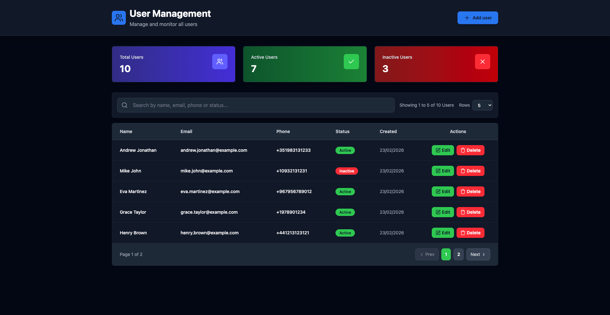

# User Management App

This project is a **CRUD User Manager** built with the **MERN stack** (MongoDB, Express, React, Node.js).  
It allows you to manage users (create, read, update, delete) securely and efficiently with a modern, responsive interface.

## 🌐 Live Demo

Check out the live demo:  
[](https://mern-user-management-eta.vercel.app/)

[](https://mern-user-management-eta.vercel.app/)

> ⚠️ **Note:** On free hosting plans, the backend may take **30–60 seconds to respond** on the first visit due to cold start. Subsequent requests will be faster.

---

The app includes:

- User management with active/inactive status
- Quick statistics (total, active, inactive)
- Dynamic search
- Modals for creating/editing users
- Admin-protected actions via **admin token**

---

## 🎯 Project Goals

The main goals of this project are to:

- Implement a full CRUD application for user management
- Demonstrate frontend-backend integration via a REST API
- Implement **admin authentication via token** to protect sensitive actions
- Build a clean and responsive UI with Tailwind CSS
- Apply basic security best practices in both frontend and backend

---

## 🛠️ Technologies & Libraries

### Frontend

- **React** – Main UI framework
- **Vite** – Fast development and build tool
- **Tailwind CSS** – Utility-first responsive styling
- **Framer Motion** – Animations and transitions
- **Lucide React** – SVG icon library
- **Formik + Yup** – Form handling and validation
- **react-phone-input-2** – International phone input

### Backend

- **Node.js** – JavaScript runtime
- **Express** – REST API framework
- **MongoDB** – NoSQL database
- **Mongoose** – MongoDB object modeling
- **CORS** – Cross-origin resource sharing
- **Express Rate Limit** – Basic API rate limiting
- **dotenv** – Environment variable management
- **Nodemon** – Development auto-reload

---

## 💡 Features

- List users with pagination
- Dynamic user search
- Create, edit, and delete users (protected with admin token)
- Interactive modals for adding/updating users
- Quick statistics: total, active, inactive users
- Mobile-friendly UI

---

## 🔑 Admin Token

To enable write actions (create, update, delete), an **admin token** must be provided in `.env`.  
This token protects the app in demo mode and ensures only authorized users can perform sensitive actions.

---

## 🚀 Getting Started

### 1. Clone the repository

```bash
git clone https://github.com/andref218/mern_user_management.git
cd mern_user_management
```

2. Install dependencies for both server and client:

# Server

```bash
cd server
npm install
```

# Client

```bash
cd ../client
npm install
```

3. Setup environment variables:
   Create a `.env` file in ther server folder:

```env
PORT=3000
MONGODB_URI=your_mongodb_connection_string_here
DATABASE_PASSWORD= your_database_password
ADMIN_TOKEN=your_admin_token
DEMO_MODE=true

```

4. Setup environment variables:
   Create a `.env` file in ther client folder:

```env
VITE_API_URL=http://localhost:3000/api/v1
VITE_ADMIN_TOKEN=your_vite_admin_token
```

5. Run the development servers:
   **Keep both terminals open while the servers are running.**

# Server

```bash
cd server
npm start
```

# Client

```bash
cd ../client
npm run dev
```

## 📂 Project Structure

```text
mern_user_management/
├── README.md                       # Project documentation
├── client/                         # Frontend (React + Vite)
│   ├── README.md
│   ├── eslint.config.js            # ESLint configuration
│   ├── index.html                  # Main HTML template
│   ├── package.json
│   ├── vite.config.js              # Vite configuration
│   ├── public/                     # Static assets
│   │   └── vite.svg
│   └── src/
│       ├── App.jsx                 # Main React component
│       ├── main.jsx                # React entry point
│       ├── index.css               # Global styles
│       ├── api/                    # API calls (fetch / axios wrapper)
│       ├── assets/                 # Images, icons, fonts
│       └── components/             # Reusable React components
│           ├── StatsCard.jsx
│           ├── SearchBar.jsx
│           ├── UserTable.jsx
│           └── UserModal.jsx
├── server/                         # Backend (Node.js + Express)
│   ├── README.md
│   ├── server.js                   # Entry point for the Express server
│   ├── package.json
│   ├── controllers/                # Request handlers
│   │   └── userController.js
│   ├── models/                     # Mongoose models
│   │   └── userModel.js
│   └── routes/                     # Express routes
│       └── userRoutes.js
```
